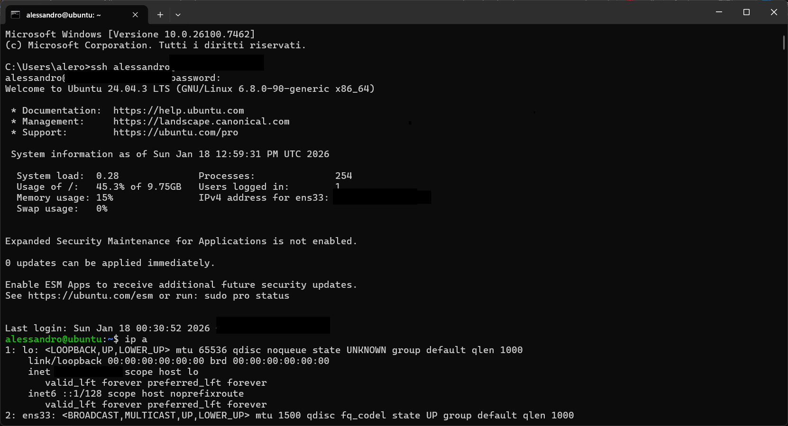
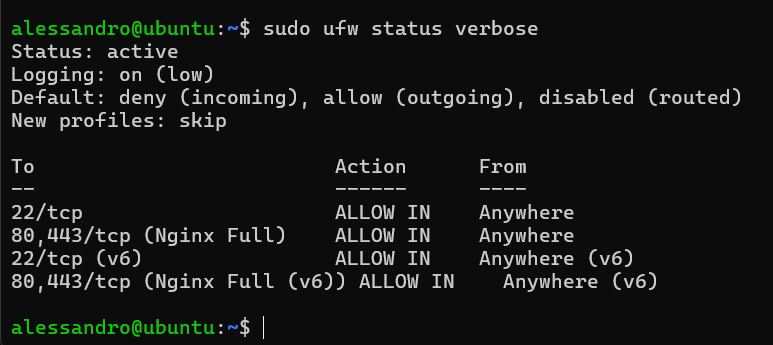

**Linux Server Administration Lab**

Project Description: A personal hands-on laboratory project focused on learning System Administration (SysAdmin) fundamentals, server hardening, and web service management.

Environment: Ubuntu Server 24.04 (Virtualised via VMware).

Goal: To build, configure, and secure a functional web server from scratch.

Ongoing progress:

###### 1. Initial Setup & System Updates (**Completed**)

Successful installation of Ubuntu Server on a Virtual Machine.

Network configuration and remote access setup via SSH.

Package management: system updates and upgrades performed using apt update && upgrade.

###### 2. Web Server Deployment (Nginx) (**Completed**)

Installed and activated the Nginx web service.

Service status verification using systemctl.

Real-time troubleshooting and traffic analysis via Access Logs (/var/log/nginx/access.log).

###### 3. User Management & File Permissions (**Completed**)

Advanced File System navigation (cd, ls -la, absolute vs. relative paths).

File and directory operations (touch, mkdir, mv).

System Security: Implemented chmod to manage Read/Write/Execute permissions (e.g., 600 for private files).

Process management and resource monitoring using htop.

###### 4. Security & Hardening (Firewall) (**Completed**)

Installation and configuration of UFW (Uncomplicated Firewall).

Access Rule Configuration:

Port 22 (SSH) -> Allowed (to prevent lockout).

Port 80/443 (Web) -> Allowed.

Default Policy -> Deny Incoming.

###### 5. Advanced Authentication (SSH Keys) (**Ongoing**)

Generating Public/Private key pairs.

Disabling password-based login to prevent Brute Force attacks.

